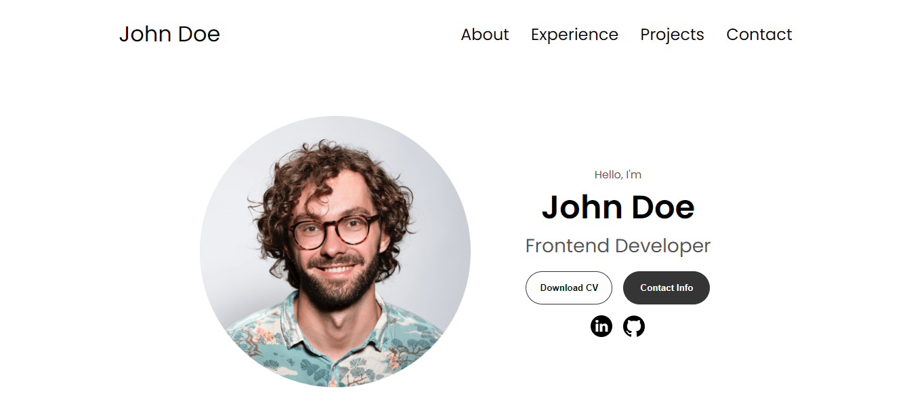

# Practice Portfolio for CC
Creating a Personal Portoflio via CC instructions. Using this as practice, not official portfolio just yet. May eventually turn into official personal portfolio website, but we'll just have to wait and see.

## <a href="https://cc-practice-portfolio.netlify.app/">Live Demo Site</a>
<kbd></kbd>

## Features
- deployed via Netlify
- Basic HTML, CSS and JavaScript

### Acknowledgements
Inspired by <a href="https://github.com/Ade-mir">@Ade-mir</a> and based on his video tutorial off his Youtube Channel <a href="https://youtu.be/ldwlOzRvYOU">How to Become a Developer</a>
